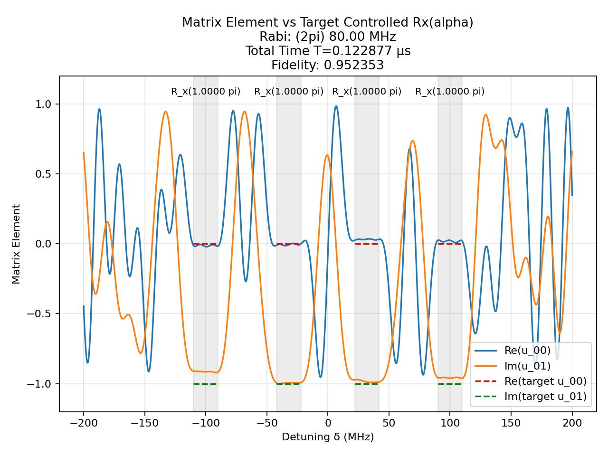
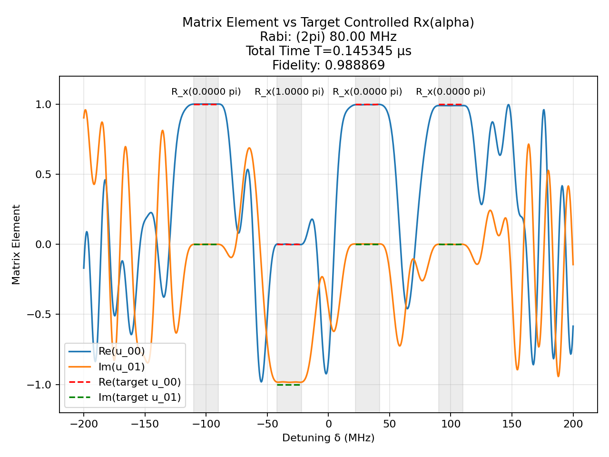
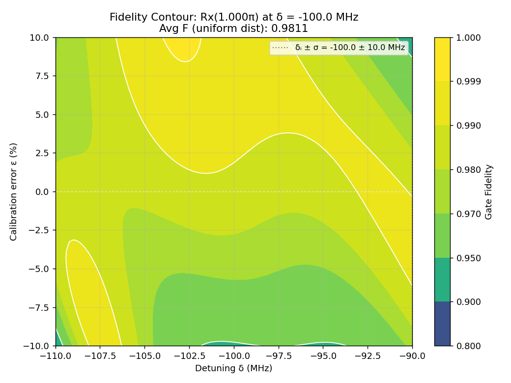
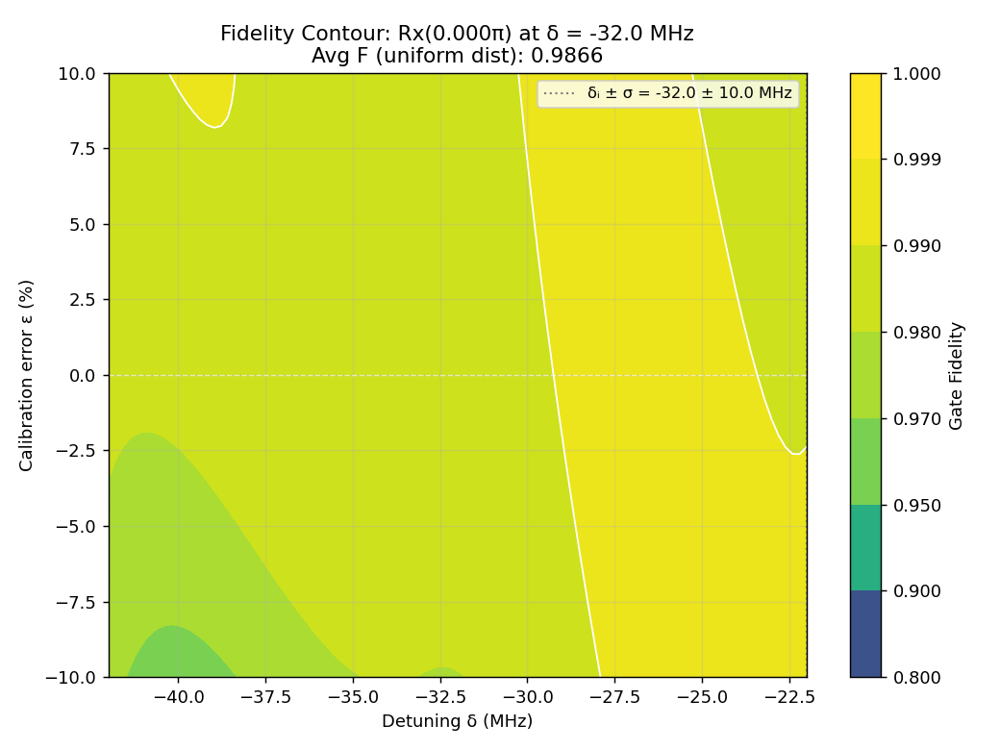
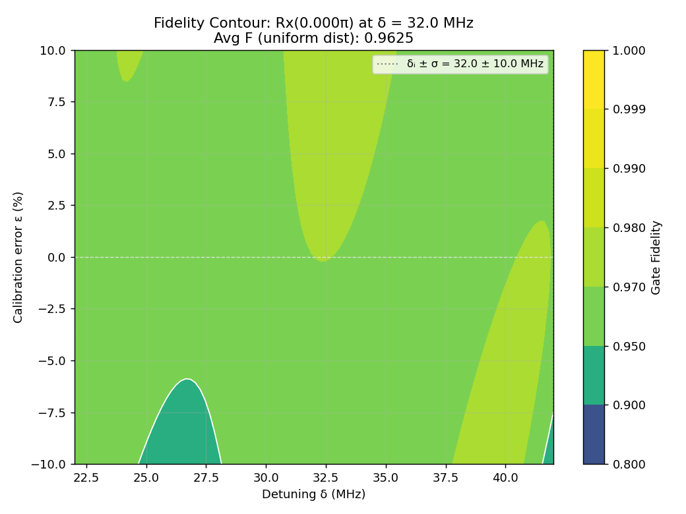
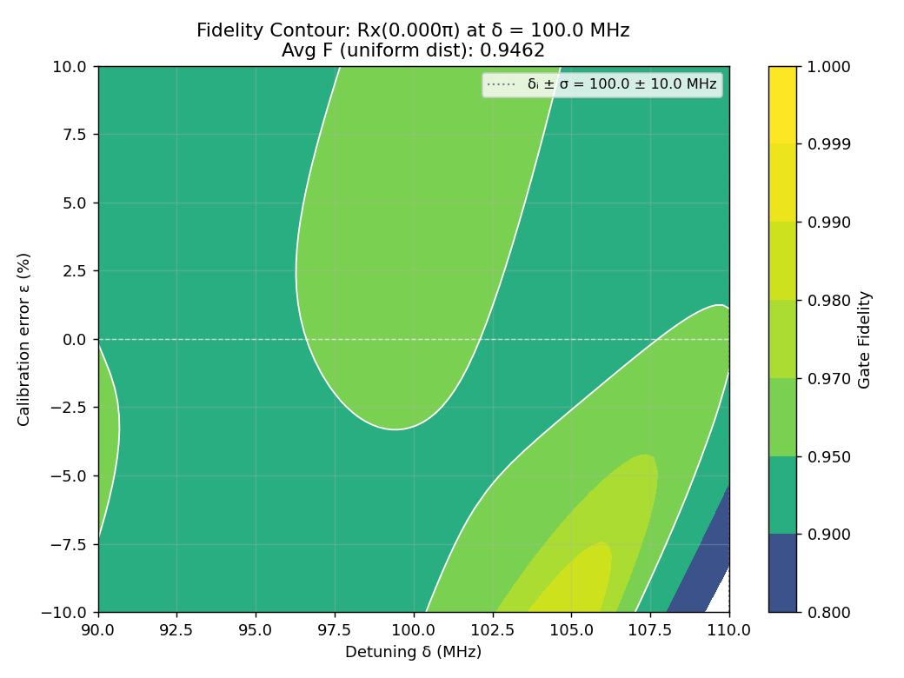
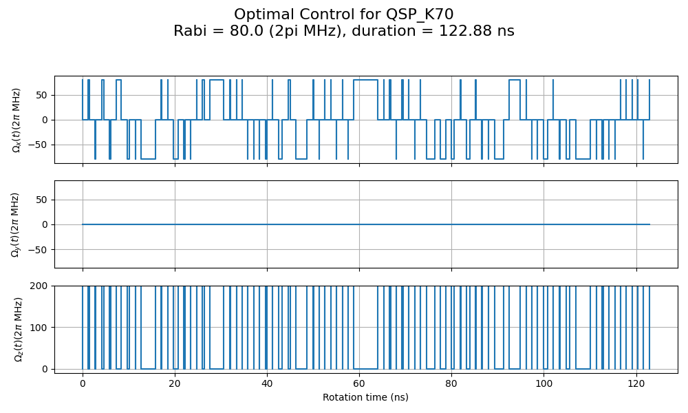
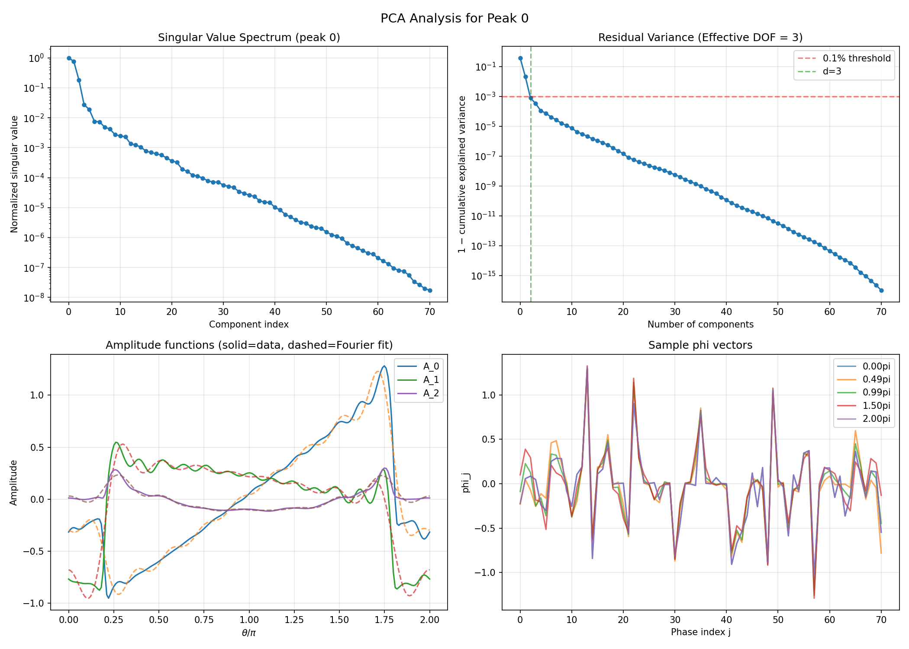
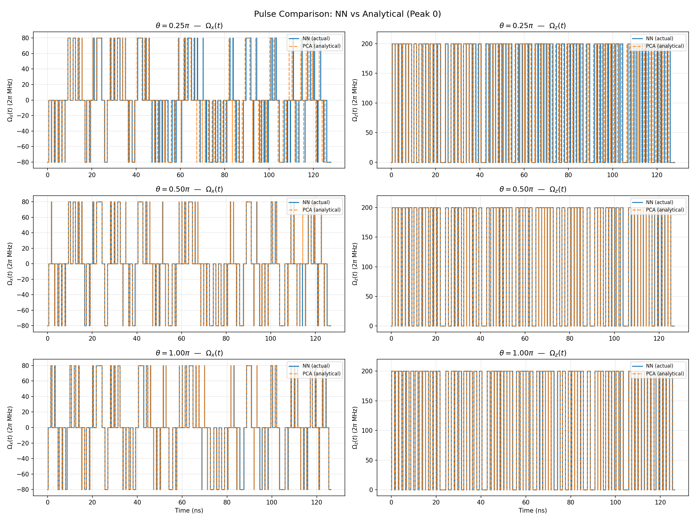
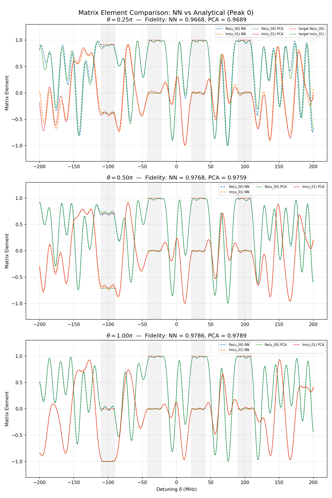

# Detuning-Selective Unitary Control via QSP, Neural Networks, and PCA

This project implements a framework for designing detuning-selective quantum control pulses using **Quantum Signal Processing (QSP)**, optimized with neural networks and analyzed via **Principal Component Analysis (PCA)**. The goal is to engineer pulse sequences that perform independent single-qubit rotations at distinct detuning frequencies — enabling multiplexed quantum operations on spectrally resolved qubit ensembles (e.g., NV centers in hBN, Rydberg atoms).

## Background

In many quantum hardware platforms, multiple qubits are addressable by their resonance frequency (detuning from a drive). A key challenge is to design a single pulse sequence that simultaneously enacts a target rotation $R_x(\alpha_i)$ on the qubit at detuning $\Delta_i$, while leaving qubits at other detunings unaffected or independently controlled.

This project attacks that problem via the **Quantum Signal Processing** framework: the qubit's response to an alternating sequence of signal and control operations is a Laurent polynomial in $e^{i\theta}$, where $\theta$ encodes the detuning. The QSP phase sequence $\{\phi_0, \ldots, \phi_K\}$ fully determines the resulting unitary — and finding the right phases for a desired gate is a high-dimensional optimization problem.

The QSP formulation follows the gradient-based approach of [arXiv:2312.08426](https://arxiv.org/abs/2312.08426).

## System Parameters (hBN reference system)

| Parameter | Value |
|-----------|-------|
| Detuning centers | $\Delta \in \{-100, -32, +32, +100\}$ MHz |
| Max detuning $\Delta_0$ | 200 MHz |
| Rabi frequency $\Omega$ | 80 MHz |
| Robustness window | ±10 MHz per peak |
| QSP degree $K$ | 70 (i.e., 71 phases $\phi_0 \ldots \phi_{70}$) |

## Approach

### 1. QSP Pulse Construction

The control sequence is:

$$U(\theta) = C(\phi_0)\, S(\theta)\, C(\phi_1)\, S(\theta)\, \cdots\, C(\phi_K)$$

where:
- **Signal operator** $S(\theta) = R_x(\theta)$ — free evolution under the detuning
- **Control operator** $C(\phi_j; \delta)$ — a driven rotation whose axis is tilted by the detuning $\delta$

The detuning $\delta$ maps to a QSP angle via $\theta = \frac{\pi}{2}\left(1 + \frac{\delta}{\Delta_0}\right) \in [0, \pi]$.

Gate fidelity is measured as the single gate haar-averaged fidelity:

$$F = \frac{|Tr(U_\text{target}^\dagger\, U)|^2 + 2}{6}$$

averaged over detuning samples within the robustness window.

### 2. Neural Network Phase Generator

A **`PulseGeneratorNet`** is trained per detuning peak to map a target rotation angle $\theta$ to the full QSP phase vector $\phi \in \mathbb{R}^{K+1}$:

- **Input:** Fourier-encoded $\theta$ (8 frequency basis functions)
- **Architecture:** 4-layer MLP, 128 hidden units, SiLU activations
- **Optimizer:** Adam with cosine annealing
- **Output:** $(\phi_0, \ldots, \phi_{70})$

A **joint multi-peak network** (`JointPulseGeneratorNet`) jointly maps all $N$ target angles $(\alpha_1, \ldots, \alpha_N)$ to the shared phase sequence, enabling simultaneous multi-peak control with a single pulse schedule.

### 3. PCA Dimensionality Reduction

Once the network is trained, PCA is applied to the phase manifold $\{\phi(\theta)\}_\theta$ to extract the effective degrees of freedom:

$$\phi(\theta) = \bar{\phi} + \sum_{j=0}^{d-1} A_j(\theta)\, \mathbf{b}_j$$

where $\mathbf{b}_j$ are principal components and $A_j(\theta)$ are scalar amplitude functions. For $K = 70$, **only $d = 3$ components** explain **99.92%** of the variance.

Each amplitude function $A_j(\theta)$ is then fit with a Fourier series, yielding a compact analytical formula for the full 71-parameter pulse.

**Example decomposition (Peak 0):**

```
phi(theta) = phi_mean
           + A_0(theta) * b_0    [61.60% variance]
           + A_1(theta) * b_1    [36.29% variance]
           + A_2(theta) * b_2    [ 2.02% variance]

A_0(theta) = -0.6983 sin(theta) - 0.1023 cos(theta) - 0.1697 sin(2*theta) + ...
A_1(theta) = -0.3910 cos(theta) + 0.1392 sin(theta) - 0.2976 cos(2*theta) + ...
```

Fidelity of the PCA-reconstructed pulses is comparable to the original network:

| $\theta / \pi$ | NN fidelity | PCA fidelity |
|:-:|:-:|:-:|
| 0.25 | 0.9668 | 0.9689 |
| 0.50 | 0.9768 | 0.9759 |
| 1.00 | 0.9786 | 0.9789 |

## Results

### QSP Phase Optimization

The plots below show the $U_{00}$ matrix element of the QSP unitary as a function of detuning, for a K=70 sequence, at different stages of optimization (loss values in filenames).

| Early (loss ≈ 0.036) | Converged (loss ≈ 0.001) |
|:---:|:---:|
|  |  |

Final $U_{00}$ profile (K=70):


### Gate Fidelity Contours

Fidelity heatmaps as a function of QSP angle $\theta$ and Rabi scale $\Omega / \Omega_0$, for each of the four detuning peaks:

| Peak 0 | Peak 1 | Peak 2 | Peak 3 |
|:---:|:---:|:---:|:---:|
|  |  |  |  |

### Pulse Schedule

Example pulse schedule showing the time-domain Rabi frequency and detuning:



### PCA Analysis (Peak 0)

Singular value spectrum, explained variance, amplitude functions, and sample $\phi(\theta)$ trajectories:



### Analytical vs. NN Pulses

Comparison of pulses generated by the full NN versus the 3-component analytical reconstruction:




## Repository Structure

```
.
├── single_pulse_optimization_QSP/
│   └── qsp_fit_x_rotation.py      # Gradient-based QSP optimizer, signal/control operators
├── neural_network_optimization/
│   ├── model.py                   # JointPulseGeneratorNet (multi-peak)
│   ├── train.py                   # Training loop
│   └── inference.py               # Production pulse generation API
├── nn_pulse_generator.py          # Per-peak PulseGeneratorNet + PCA analysis
├── util.py                        # Pauli matrices, fidelity, error models, visualization
├── scaling_law.py                 # QSP degree K vs. fidelity scaling analysis
├── streamlit_app.py               # Interactive web UI
├── test.py                        # Unit tests
├── plots_relaxed/                 # QSP optimization figures
└── nn_pulse_output/               # Trained models, PCA results, CSVs
```

## Usage

### Train a per-peak network and run PCA

```python
python nn_pulse_generator.py --peak_index 0 --steps 5000
```

Outputs to `nn_pulse_output/`:
- `peak0_K70.pt` — trained model weights
- `basis_functions_peak0.csv` — PCA basis vectors $(K+1) \times d$
- `fourier_coefficients_peak0.csv` — Fourier fits of $A_j(\theta)$
- `pca_peak0.png` — PCA diagnostic plots
- `analytical_form_peak0.txt` — human-readable decomposition

### Multi-peak joint training

```bash
python -m neural_network_optimization.train --Omega_mhz 80 --K 70 --steps 20000
```

### Production inference

```python
from neural_network_optimization.inference import load_model, generate_pulse

model = load_model(Omega_mhz=80, K=70)
pulse_df = generate_pulse(model, alpha_vals=[0.5, 1.0, 0.3, 0.8])
```

### Interactive UI

```bash
streamlit run streamlit_app.py
```

## Dependencies

```
torch
numpy
pandas
matplotlib
qutip
tqdm
pwlf
streamlit
altair<5
```

Install with:

```bash
pip install -r requirements.txt
```

## Reference

Gradient-based QSP optimization follows: [arXiv:2312.08426](https://arxiv.org/abs/2312.08426)
